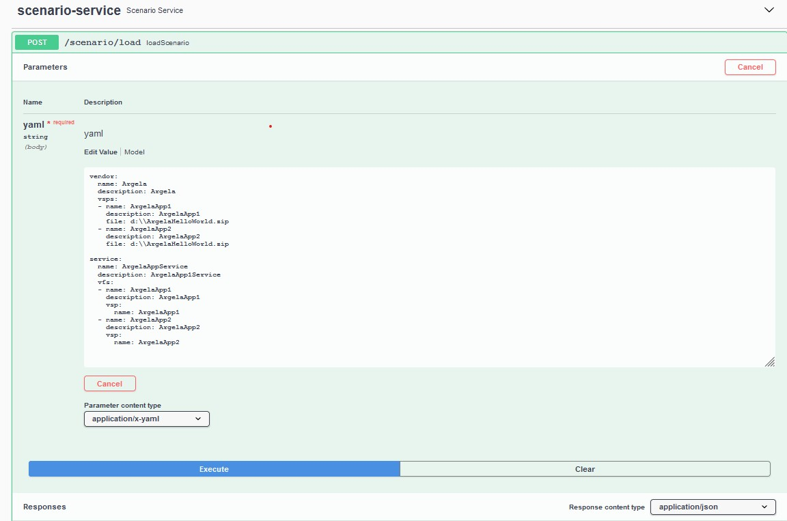
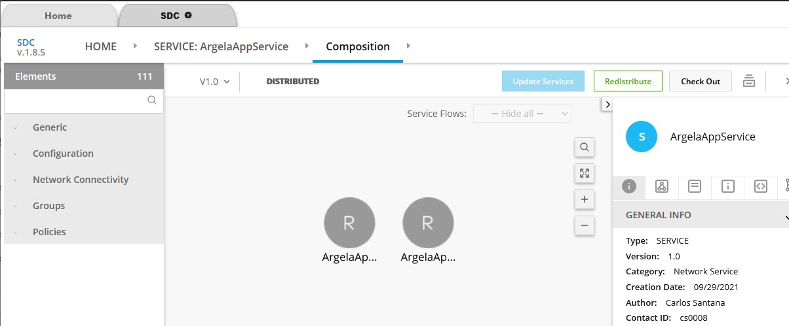
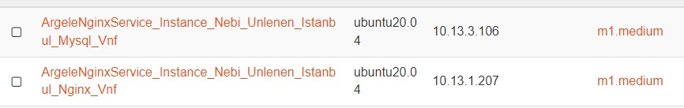
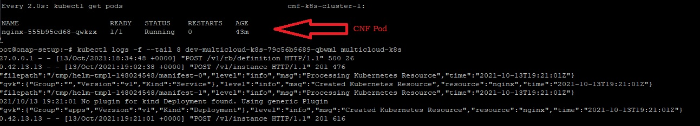

# Argela ONAP API

```
                          _           ____  _   _          _____             _____ _____ 
     /\                  | |         / __ \| \ | |   /\   |  __ \      /\   |  __ \_   _|
    /  \   _ __ __ _  ___| | __ _   | |  | |  \| |  /  \  | |__) |    /  \  | |__) || |  
   / /\ \ | '__/ _` |/ _ \ |/ _` |  | |  | | . ` | / /\ \ |  ___/    / /\ \ |  ___/ | |  
  / ____ \| | | (_| |  __/ | (_| |  | |__| | |\  |/ ____ \| |       / ____ \| |    _| |_ 
 /_/    \_\_|  \__, |\___|_|\__,_|   \____/|_| \_/_/    \_\_|      /_/    \_\_|   |_____|
                __/ |                                                                    
               |___/                                                                     

Written By: Nebi Volkan UNLENEN ( unlenen@gmail.com ) 
```

This project aims to call ONAP complex APIs easily with converting them basic rest APIs.

## DOCKER Container Usage
```
    docker run --name onap-as-a-service -d -e ONAP_IP=192.168.135.171 -p 8080:8080 unlenen/onap-as-a-service
```

## COMPILE
```
    mvn clean install
```
    

## RUN
```
    java -jar target/onap_service_manager-1.0.jar --onap.ip=<ONAP_IP> --server.port=8080
```

## USAGE 
```
    curl http://localhost:8080/<API_URL>
    ex: get cloud regions : 
        curl http://localhost:8080/cloud/regions  | jq
```

## Swagger Rest UI
```
    http://localhost:8080/swagger-ui/
```  


## Scenario

Scenario Service allows to create ONAP resource automaticaly from a yaml file

## Scenario Load Call

### Scenario Load Example VNF
```yaml
#########################################################################
#                                                                       #
#       ARGELA TECHNOLOGIES                                             #
#       ONAP AS A SERVICE DEMO DATA                                     #
#       App1 : Nginx                                                    #
#       App2 : Mysql                                                    #
#                                                                       #
#       For using in your home openstack please provide                 #
#       x) Nginx heat template                                          #
#       x) Mysql heat template                                          #
#       x) Openstack cluster with version > pike                        #
#       x) cloudRegions and tenantId configuration must be change to    #
#          your own openstack information                               #
#       x) Profile must be change due to your heat env                  #
#########################################################################

# Vendor and App Definitions
vendor:
  name: Argela
  description: Argela
  vsps:
  - name: Nginx
    description: Nginx Server
    file: d:\\ArgelaNginx.zip
  - name: MysqlServer 
    description: Mysql Server 
    file: d:\\ArgelaMysqlServer.zip
    
# Service Definitions
service:
  name: ArgelaWebService
  description: ArgelaWebService
  # Customers
  customers:
  - id: nebiunlenen
    name: Nebi Volkan Unlenen
  - id: canerturkaslan
    name: Muhammed Caner Turkaslan
  - id: hilalalsac
    name: Feyza Hilal Alsac
  - id: erolozcan
    name: Erol Ozcan
    
  # Related Tenants
  tenants:
  - id: 5aa6ebb7ed1145f1b59c579d01c4ad36
  - id: 207a223d949544c38c8e369bc309c381
  
  # Service Components
  vfs:
  - name: Nginx
    description: Nginx
    vsp:
      name: Nginx
  - name: MysqlServer
    description: MysqlServer
    vsp:
      name: MysqlServer
  
  # Service Instances
  serviceInstances:
  - name: ArgelaWebService_Instance_Nebi_Unlenen
    customer:
      id: nebiunlenen
    owningEntity:
      id: a4dc9387-4548-43b3-8aed-5a38c9331d3d
      name: Argela_NFV_CC
    project: Argela_NFV_CC_ONAP_VNF_DEMO
    # Vnfs
    vnfs:
    - name: ArgelaWebService_Instance_Nebi_Unlenen_Istanbul_Nginx_Vnf
      lineOfBusiness: NFV_POC
      platform: Argela_Istanbul_NFVLAB_Openstack
      tenant:
        id: 5aa6ebb7ed1145f1b59c579d01c4ad36
      vf: 
        name: Nginx
      
      # Vnf modules
      vfModules:
      - name: ArgelaWebService_Instance_Nebi_Unlenen_Istanbul_Nginx_VfModule
        availabilityZone: nova
        vfModel:
          modelType: Nginx..nginx..module-0
        profile:
          name: NginxProfile
    # Vnfs  
    - name: ArgelaWebService_Instance_Nebi_Unlenen_Istanbul_Mysql_Vnf
      lineOfBusiness: NFV_POC
      platform: Argela_Istanbul_NFVLAB_Openstack
      tenant:
        id: 5aa6ebb7ed1145f1b59c579d01c4ad36
      vf: 
        name: MysqlServer
    
      # Vnf modules
      vfModules:
      - name: ArgelaWebService_Instance_Nebi_Unlenen_Istanbul_Mysql_VfModule
        availabilityZone: nova
        vfModel:
          modelType: Mysqlserver..mysql..module-0
        profile:
          name: MysqlServerProfile
          
         
cloudRegions:
# Istanbul Openstack
- cloudOwner: CloudOwner
  name: argela_ist_kolla_openstack_regionone
  complexName: argela_ist_nfvlab
  regionName: RegionOne
  domain: argela
  defaultProject: onap_project
  authServiceURL: "https://<openstack-ip>:5000/v3"
  authUser: "onap_user"
  authPassword: "argela"
  cloudType: OPENSTACK
  tenants:
  - id: 5aa6ebb7ed1145f1b59c579d01c4ad36
    name: onap_project
  availabilityZones:
  - name: nova
    hypervisorType: kvm
# Ankara Openstack
- cloudOwner: CloudOwner
  name: argela_ankara_openstack_regionone
  complexName: argela_ankara_nfvlab
  regionName: RegionOne
  domain: argela
  defaultProject: onap_project
  authServiceURL: "https://<openstack-ip>:5000/v3"
  authUser: "onap_user"
  authPassword: "argela"
  cloudType: OPENSTACK
  tenants:
  - id: 207a223d949544c38c8e369bc309c381
    name: onap_project
  availabilityZones:
  - name: nova
    hypervisorType: kvm
    
profiles:
- name: NginxProfile
  parameters:
  - name: vnf_image
    value: ubuntu20.04
  - name: vnf_flavor
    value: m1.medium
  - name: vnf_network_name
    value: ONAP_VNF_PRIVATE_NET
  - name: vnf_name
    value: ArgelaAppService_Istanbul_Vnf_Test1
  - name: dcae_collector_ip
    value: 192.168.135.171
  - name: dcae_collector_port
    value: 30417
- name: MysqlServerProfile
  parameters:
  - name: vnf_image
    value: ubuntu20.04
  - name: vnf_flavor
    value: m1.medium
  - name: vnf_network_name
    value: ONAP_VNF_PRIVATE_NET
  - name: vnf_name
    value: ArgelaAppService_Istanbul_Vnf_Test2
  - name: dcae_collector_ip
    value: 192.168.135.171
  - name: dcae_collector_port
    value: 30417
```  


### Scenario Load Example CNF  ( Many thanks to Lukasz Rajewski to create a cnf) 
```yaml
#########################################################################
#                                                                       #
#       ARGELA TECHNOLOGIES                                             #
#       ONAP AS A SERVICE DEMO DATA                                     #
#       App1 : Nginx                                                    #
#                                                                       #
#       For using in your home k8s cluster please provide               #
#       x) Nginx cnf template                                           #
#       x) K8S cluster                                                  #
#       x) cloudRegions and tenantId configuration must be change to    #
#          your own k8s information                                     #
#       x) Profile must be change due to your cnf env                   #
#########################################################################

# Vendor and App Definitions
vendor:
  name: Argela_Test
  description: Argela_Test
  vsps:
  - name: CNF_Nginx_Helm_3
    description: Nginx Server
    file: d:\\data\helm\native_argela_nginx_cnf.zip
    
# Service Definitions
service:
  name: CNF_ArgelaWebService_Helm3
  description: ArgelaCNFWebService
  # Customers
  customers:
  - id: nebiunlenen
    name: Nebi Volkan Unlenen
    
  # Related Tenants
  tenants:
  - id: argelans
  
  # Service Components
  vfs:
  - name: CNF_Nginx_Helm_3
    description: CNF_Nginx
    vsp:
      name: CNF_Nginx_Helm_3
  
  # Service Instances   
  serviceInstances:
  - name: CNF_ArgelaWebService_Instance_Nebi_Unlenen
    customer:
      id: nebiunlenen
    owningEntity:
      id: a4dc9387-4548-43b3-8aed-5a38c9331d3d
      name: Argela_NFV_CC
    project: Argela_NFV_CC_ONAP_VNF_DEMO
    
    # Vnfs
    vnfs:
    - name: CNF_ArgelaWebService_Instance_Nebi_Unlenen_Ist_Nfvlab_Onap_k8s_vnf
      lineOfBusiness: NFV_POC
      platform: Argela_Istanbul_NFVLAB_Openstack
      tenant:
        id: argelans
      vf: 
        name: CNF_Nginx_Helm_3
      vfModules:
      - name: CNF_ArgelaWebService_Instance_Nebi_Unlenen_Ist_Nfvlab_Onap_k8s_VF
        availabilityZone: K8S
        vfModel:
          modelType: CnfNginxHelm3..helm_nginx..module-1
        profile:
          name: NginxProfile
  
cloudRegions:
- cloudOwner: CloudOwner
  name: argela_ist_nfvlab_onap_k8s_inst1_135_152
  complexName: argela_ist_nfvlab
  regionName: argela_ist_nfvlab_onap_k8s
  cloudType: KUBERNETES
  domain: argelans
  configParameters: '{"apiVersion":"v1","kind":"Config","clusters":[{"cluster":{"api-version":"v1","certificate-authority-data":"LS0tLS1CRUdJTiBDRVJUSUZJQ0FURS0tLS0tCk1JSUN3akNDQWFxZ0F3SUJBZ0lCQURBTkJna3Foa2lHOXcwQkFRc0ZBREFTTVJBd0RnWURWUVFERXdkcmRXSmwKTFdOaE1CNFhEVEl4TVRBd09EQXdORFl5TVZvWERUTXhNVEF3TmpBd05EWXlNVm93RWpFUU1BNEdBMVVFQXhNSAphM1ZpWlMxallUQ0NBU0l3RFFZSktvWklodmNOQVFFQkJRQURnZ0VQQURDQ0FRb0NnZ0VCQUt2ZktOVEVham53CkJWcHRaU2FhZFdTOVNwTE1sQ0xYcVJFb1FBWkJRbk90UVlDeUU1Undsb2tpS0JCT0tNR1NFa1lMVGVGT0RieTkKZXdDYUt3KzEwM1ZwWlVpaGpzRGpTZzhzUGp3TXNWL2dyeks5WFl6WHY3bTRPbnFITWlRUnRMU1lacVpkYzBNNgpESkR6bUNFQmZXVXlzSFdGQldJMG5hRmgwTFRGQ2JUUUM0SWc5Z1dSVFI2MFhNNjhzTkl3QUNXVStiK0xXa1pvCkk5c1NIMk9yRXV0N1RCK1pralArVlZjcm1RMWoxby9URjN2WU5UVC92VVptVVRickZ0U285R0MyMUlBMnM1bDkKZ2pSWHNESnJVUTdyTHgycWJOV081cENETTRBRkhSR0RFMXNaY1BOb0t5ZFZEcWFFdzY2Z09BUWxVUjNvUndwTwoyeXhjZGNYNmZFa0NBd0VBQWFNak1DRXdEZ1lEVlIwUEFRSC9CQVFEQWdLa01BOEdBMVVkRXdFQi93UUZNQU1CCkFmOHdEUVlKS29aSWh2Y05BUUVMQlFBRGdnRUJBREJqQk1RTzNBQUJiMWltYmFzRlpCL0E5NXNCeFBHNzB4djUKWmdBWS92YXExeHEvVERwcHBIUUYrUWtFS1o5a1ZLR0k3d2Zrc01LWGtJaVpwc1FJSVI5ZXY4cWU2R2EvSUQzZgpYYzlGUXFqdWxsVFNTcFViY281L09Md2F4bnZiM2Z2Z0kxOVY5c3owM2M0OXB6NU1iRUhxUHpiMzFvRWliNy9ICmlmVnlqaFVRMGFPV1RRZU9YTDJiWG5uN2lpMkNrcVZiL0Y3emxUaVZsSTVvdHowVDhPRm5XRUxNTDZxMDJwdkEKUDczWFVOMWxwQVNnZ1pRYis5YU1wVktsQ3ZnRUhhcndlL3FkV0sxOTkrdzIxQ1B3QkZOeUs4dGRKKzhFd0tCMQpSWGx2b0VpZG5oblJIanpFNEk5TG9LRktENVBuT0JMNHIva2svTHJxam85RllrT0wvcGM9Ci0tLS0tRU5EIENFUlRJRklDQVRFLS0tLS0K","server":"https://192.168.135.111:6443"},"name":"cnf-cluster"}],"contexts":[{"context":{"cluster":"cnf-cluster","user":"kube-admin-cnf-cluster"},"name":"cnf-cluster"}],"current-context":"cnf-cluster","users":[{"name":"kube-admin-cnf-cluster","user":{"client-certificate-data":"LS0tLS1CRUdJTiBDRVJUSUZJQ0FURS0tLS0tCk1JSUM2VENDQWRHZ0F3SUJBZ0lJWFJUd0tBak9hZDh3RFFZSktvWklodmNOQVFFTEJRQXdFakVRTUE0R0ExVUUKQXhNSGEzVmlaUzFqWVRBZUZ3MHlNVEV3TURnd01EUTJNakZhRncwek1URXdNRFl3TURRM01qTmFNQzR4RnpBVgpCZ05WQkFvVERuTjVjM1JsYlRwdFlYTjBaWEp6TVJNd0VRWURWUVFERXdwcmRXSmxMV0ZrYldsdU1JSUJJakFOCkJna3Foa2lHOXcwQkFRRUZBQU9DQVE4QU1JSUJDZ0tDQVFFQXF4bGtsaGRQS2VyM0dnalBxSWRoOE1LcFBnSVcKWWFrUCtFUU8ydXVmNTRLeWxrb20xUW9MYzMyczJQR1pDRVBvQkZjV0dvbVNjL2VtZVNjRXBXUUljUElVYkdzTQpqM2F2bHJtWXNzUVlLWWdWWTNhd2ZQTUw4VW5Wczh1VjJ6UGpWaXh3TFU1b2djRFE2Qlc5U2JFdmo4ZllXVjcyCmlpaVlUOTNmZDRqOXJzOGprK1BTVXhDdmpWWDVjTmlWWUdwSTZMdmVpQ0g3Q0VwaTVFRC9Rb0QwK3ltSFoxUTkKRUNwS1VOSDBpS0RWVVB6VXpwV0JCcGl5MkwwOGs0dXFBYTBzR0p4cVFvTW9ybVVtZVNIT085eEhWenNpbUdacgpEek5RaHBnT28wRjNYb25FUHNtK3htUEpRdXlmV1VwazRrYzVzQldueGlza3gyTW5mamFuU1ZOVFl3SURBUUFCCm95Y3dKVEFPQmdOVkhROEJBZjhFQkFNQ0JhQXdFd1lEVlIwbEJBd3dDZ1lJS3dZQkJRVUhBd0l3RFFZSktvWkkKaHZjTkFRRUxCUUFEZ2dFQkFCbHVSMDlOaXloMnNXa1VycDhTRTBwYWVTN095eGxTR0RpS2dJbnJmb25sc3NYQgp2bFZReHpYd0FqNCtZK1ltZ1VBQ0pnY2tPaUpIbjcwWisydzNSOFFHdXpPQWRsOTNDWUNtWTh5bHVZUUlha0VBCmJET3pCdnNkME1YRW5pUWd2M2Z5cU9hYTh0dVRVV3pDd2RPSmE3OHQwRGErczFmRHZScktlcTJOcks5aTVadEsKUkQ2MWpYVlFONUNLQXo3TEpBekZhcVpRbTNNb1RnMkJnMTRuRWNKYzVSVTlpZ2RJSml6THR5ajdCSVZHUkxLWgpGZWIyOGVMa2tmSzh5VTZnK3ROWC9FaEJGL3hXMmFxYmJsWHBuRnlITnU2WHFGNFNDZGJVd1lRNERMamM2T3NlCm1uVk5qalNzRGR4SGlrZ050L2pxcDBZVjdLK1V5SkxSZkFSbkwrTT0KLS0tLS1FTkQgQ0VSVElGSUNBVEUtLS0tLQo=","client-key-data":"LS0tLS1CRUdJTiBSU0EgUFJJVkFURSBLRVktLS0tLQpNSUlFcEFJQkFBS0NBUUVBcXhsa2xoZFBLZXIzR2dqUHFJZGg4TUtwUGdJV1lha1ArRVFPMnV1ZjU0S3lsa29tCjFRb0xjMzJzMlBHWkNFUG9CRmNXR29tU2MvZW1lU2NFcFdRSWNQSVViR3NNajNhdmxybVlzc1FZS1lnVlkzYXcKZlBNTDhVblZzOHVWMnpQalZpeHdMVTVvZ2NEUTZCVzlTYkV2ajhmWVdWNzJpaWlZVDkzZmQ0ajlyczhqaytQUwpVeEN2alZYNWNOaVZZR3BJNkx2ZWlDSDdDRXBpNUVEL1FvRDAreW1IWjFROUVDcEtVTkgwaUtEVlVQelV6cFdCCkJwaXkyTDA4azR1cUFhMHNHSnhxUW9Nb3JtVW1lU0hPTzl4SFZ6c2ltR1pyRHpOUWhwZ09vMEYzWG9uRVBzbSsKeG1QSlF1eWZXVXBrNGtjNXNCV254aXNreDJNbmZqYW5TVk5UWXdJREFRQUJBb0lCQVFDWk96dVhJN2IxSG9aQQpYYVhFRThNR0FQL2JGYmwvcXc0dlZKeE5PWHBTdHYxRGxaTWpka1I5SVE5Y2x6cHJhWTF2M2FKaEQ5WUdYOE5LCmUwUXc3dDZVY0drVUUrY0MwTk0rVkdkSnFrN05XeDkwbllZLzBOZGdON1RZdWJveXYweVpEMkZEWWhZOEpqZXgKc2s1OG9kK3JqOW5WYURPNTFkTmFxNlVIZzd0V0Fwc1lRTWc1aDk5SXEvRFZLR1FLYjRDeC94V2xicnMwN3gwTgpoL29LV3FlNWtiNkpEVzkzbW91ckpvRXBSWWQvM3BnbHRwYTRjRGJQT3dLcXJhYmtiL09rTW1lSisrSXFyS2pzCkt3ZTFzQXQwYlF5Qkh1bldxTE9ZcEgxN2IydmhjYXdNWmhDTmxBNVBMR21haGw5ZFdxMWpUalFYWlgxWi9BdjEKMHg3blFhL3hBb0dCQU1VTHJzeVEybWQ4NEpmMllwMWgrNVZEVGhUUGIyRERCZ1U0RjNQY05sL1VCMzU4MzdTRgozRDl0Tmx3MnVySFB0bUwvcmtxb3F4T0FDQ1FUMDFGdWQ3QWVKRTQrRWZOS21jSE1WTG1sc1hpb0RNNFNYZmdxCjB4VTJpeFN0S3Aya0hrWW1aeUk1MFgwUUM5QkdpTnVKNnNwSEZHOFlJc2ZuaXIvd0kxWDNMKys3QW9HQkFONUsKWk5tL2VQUjJMUjVmbmpubExpZzBuWERjOUdReUtWaHA4NjMrdGlabWI3R3R4WFFNaGRCcThoQmM3bGJ6QVdxawpBTHNNanBrTDJ2eHRzajNVTG1EM1ExMWtrbC9GRXVNbG9PYkpMSHRMc1hrYXJubnN5OE51TXI5OUs3M1hHSFBwCkViaFVoNnhQeXY0ajhnc1FDMVMyWU56UTNlcUJONHZKdXRNaXhzeDVBb0dBTks2azg0aWUvQ0JGSkJ2NXpiNU8KdDEraFZxc0hTa1dhTEhjTXZpdFlWbEtvRmtkb3dDa3g4N3ROVjJaQ2tCdksxYmtxYmtlZVJiNXJic25tSzlWdgpKcVZJYTZyb3ZiVnFXb2c0OXRHNEcxeEM0QzNFOWY3dEpMVEtocUt0ekN2KzlCNThZSWc0M0VrWC8zMThSY1lnCkFpank2NmoyVTZBeVZwTHJ2Nll4S05VQ2dZRUF5K1dOVURaVGFsa2oxYUo3Ymp1TDlSRWVBVEtMY1lTWmJDSHoKaFB3SWRIeXRvMXJ6clJqM2ZVODdya3F2ekUybVZQME9Ob1MwSUNwQnVoMmN5eDNmVk00NW1tYnY1S3pPUUZCNQpvSGVUTjUwY3N5c0lNNHBDOVlZVlFwUThGU3hCbjhCL29vYlcwL1YxQzF4SlhtQmZKRnNOeWo1RDhDQ0twTXhyCmM5T0lhbkVDZ1lCOTBSV2FDM0JWVkMvZlhESXBuY1pxdXJ5RVVRQTk0dUFZaVcwMlBpdGdEK0E3SDI1aFhodFAKQVl6eVRoK0FrSXc2M3ZscDJiZklKUG5IcFNBQ3QzMEk3Mk1taG9JcHVUaldYMVZPaWF6TE1RazQxZnczNE1vKwphazZIbndwUzZSRng1WXB1Qlo0a2dKSlNQRDJONVpIZ2hjRU9IYVJTaGRha0NnR1FNVURWRXc9PQotLS0tLUVORCBSU0EgUFJJVkFURSBLRVktLS0tLQo="}}]}'
  tenants:
  - id: argelans
    name: argelans
  availabilityZones:
  - name: k8s
    hypervisorType: k8s
    
profiles:
- name: NginxProfile
  parameters:
  - name: k8s-rb-profile-name
    value: default
  - name: nginx.name
    value: argela-nginx-web
  - name: nginx.port
    value: 80
  - name: nginx.nodeport
    value: 30080
  - name: nginx.image
    value: nginx:latest
```

### Scenario Load Swagger Example


### Service composition at ONAP SDC after scenario executed


### Openstack instance page after scenario executed


### Kubernetes POD List after scenario executed

### Actions

#### Vendor
- Create or Use Existing Vendor
- Submit Vendor if it is newly created
#### VSP
- Create or Use Existing VSPs
- Upload artifacts if vsp is newly created
- Process artifacts if vsp is newly created
- Checkout if vsp is newly created
- Submit if vsp is newly created
- CSAR creation
#### VF
- Create or Use Existing VFs
- Certify Vf if it is newly created
#### ServiceModel
- Create or Use Existing Service
- Add VFs if service is not certified
- Certify Service if it is not certified
- Distribute Service if it is not distributed
#### Cloud
- Create or Use Existing Complex
- Create or Use Existing Region
```yaml
You should add SO Keystone information manually

- Connect
kubectl exec -it dev-mariadb-galera-0 -- mysql -u cataloguser -p"catalog123" catalogdb

- Add New Region
insert into cloud_sites (id , region_id , identity_service_id , cloud_version , clli,creation_timestamp, cloud_owner) values ('argela_ist_kolla_openstack_regionone','RegionOne','DEFAULT_KEYSTONE','2.5','RegionOne',now(),'CloudOwner');

- If your openstack different than first one , please add 

insert into identity_services (id , IDENTITY_URL, MSO_ID,MSO_PASS,ADMIN_TENANT,MEMBER_ROLE,TENANT_METADATA,IDENTITY_SERVER_TYPE,IDENTITY_AUTHENTICATION_TYPE,CREATION_TIMESTAMP,PROJECT_DOMAIN_NAME,USER_DOMAIN_NAME,ADMIN_PROJECT_DOMAIN_NAME) values('ARGELA_IST_OPENSTACK_IDENTITY' ,'https://<openstack-ip>:5000/v3','onap_user','your password','service','admin',1,'KEYSTONE_V3','USERNAME_PASSWORD',now(),'argela','argela','Default');

```
- Create or Use Existing Tenant
- Create or Use Existing Availability Zone
- Add relation to region for complex
#### Customer
- Create or Use Existing Customer
#### Subscription
- Subscribe service to AAI  if it is not exists
- Subscribe service to all customers if it is not exists
- Subscribe tenants to service and customers
#### Business General
- Create or Use Existing OwningEntity
- Create or Use Existing Project
- Create or Use Existing Platform
- Create or Use Existing Line of Business
#### ServiceInstance
- Create or Use Existing Service Instance belong to customer
#### VNF
- Create or Use Existing VNF in Service Instace belong to customer
#### VFModule
- Create or Use Existing VfModule
#### VServer
- Read Details of VServer ( flavor, image , name , node )

# REST APIs
## CLOUD

### Complex

- List of Complexs: 
```
    (GET)   /cloud/complexs
    curl -sX GET 'http://localhost:8080/cloud/complexs' | jq
```

### Region

- List of Regions:
```
    (GET)   /cloud/regions
    curl -sX GET 'http://localhost:8080/cloud/regions' | jq
```

- Add Openstack Cloud:
```
    (PUT)   /cloud/openstack/{name}/{cloudOwner}/{complexName}/{osDomain}/{osDefaultProject}?keystoneURL=&user=&password
    curl -X PUT "http://localhost:8080/cloud/openstack/<OS_NAME>/<CloudOwnerName>/<ComplexName>/<DOMAIN NAME>/<Default Project>>?keystoneURL=https%3A%2F%2Flocalhost%3A5000%2Fv3&password=<OPENSTACK PASSWORD>&user=<OPENSTACK USER>" -H  "accept: application/json"
```

### Tenant

- List of Tenants:
```
    (GET)   /cloud/tenants/{cloudOwner}/{cloudRegion}
    curl -sX GET 'http://localhost:8080/cloud/tenants/<CloudOwnerName>/<RegionName>' | jq
```

### Availability Zone

- List of Availability Zones
```
    (GET)   /cloud/availability-zones/{cloudOwner}/{cloudRegion}
    curl -sX GET 'http://localhost:8080/cloud/availability-zones/<CloudOwnerName>/<RegionName>' | jq
```

## BUSINESS

### Customer

- Create Customers
```
    (PUT)   /business/customer/{customerId}/{customerName}
    curl -sX PUT "http://localhost:8080/business/customer/<Customer ID>/<Customer Name>" | jq
```

- List of Customers
```
    (GET)   /business/customers
    curl -sX GET 'http://localhost:8080/business/customers' | jq
```

### Owning Entity

- List of Owning Entities
```
    (GET)   /business/owning-entities
    curl -sX GET 'http://localhost:8080/business/owning-entities' | jq
```

### Platforms

- List of Platforms
```
    (GET)   /business/platforms
    curl -sX GET 'http://localhost:8080/business/platforms' | jq
```

### Projects

- List of Projects
```
    (GET)   /business/projects
    curl -sX GET 'http://localhost:8080/business/projects' | jq
```

## DESIGN

### VENDOR

- List of Vendors
```
    (GET)   /design/vendors
    curl -sX GET 'http://localhost:8080/design/vendors' | jq
```

- Create New Vendor
```
    (PUT)   /design/vendor/{vendorName}/{vendorDescription}
     curl -sX PUT 'http://localhost:8080/design/vendor/<Vendor Name>/<Vendor Description>' | jq
```

- Submit New Vendor
```
    (PUT)   /design/vendor-submit/{vendorId}/{vendorVersionId}
    curl -sX PUT 'http://localhost:8080/design/vendor-submit/<Vendor ID>/<Vendor Version>' | jq
```

### Vendor Software Product (VSP)

- List of VSPs
```
    (GET)   /design/vsps
    curl -sX GET 'http://localhost:8080/design/vsps' | jq
```

- Create New VSP
```
    (PUT)   /design/vsp/{vendorId}/{vendorName}/{vspName}/{vspDescription}
    curl -sX PUT 'http://localhost:8080/design/vsp/<Vendor ID>/<Vendor Name>/<New VSP Name>/New VSP Description' | jq
```

- Get VSP Version
```
    (GET)   /design/vsp-versions/{vspId}
    curl -sX GET 'http://localhost:8080/design/vsp-versions/<VSP ID>' | jq
```

- Upload VSP File
```
    (PUT)   /design/vsp-file-upload/{vspId}/{vspVersionId}/{vspFileLocalPath}
    curl -sX PUT 'http://localhost:8080/design/vsp-file-upload/<VSP ID>/<VSP Version>/<VSP Artifact File Local Path>' | jq
```

- Process VSP File
```
    (PUT)   /design/vsp-file-process/{vspId}/{vspVersionId}
    curl -sX PUT 'http://localhost:8080/design/vsp-file-process/<VSP ID>/<VSP Version>' | jq
```

- Submit VSP
```
    (PUT)   /design/vsp-submit/{vspId}/{vspVersionId}
    curl -sX PUT 'http://localhost:8080/design/vsp-submit/<VSP ID>/<VSP Version>' | jq
```

- Create CSAR
```
    (PUT)   /design/vsp-csar/{vspId}/{vspVersionId}
    curl -sX PUT 'http://localhost:8080/design/vsp-csar/<VSP ID>/<VSP Version>' | jq
```

### Virtual Function (VF)

- List of VFs
```
    (GET)   /design/vfs
    curl -sX GET 'http://localhost:8080/design/vfs' | jq
```

- Create VF
```
    (PUT)  /design/vf/{vendorName}/{vspId}/{vspVersionName}/{vfName}/{vfDescription}
    curl -sX PUT 'http://localhost:8080/design/vf/<Vendor Name>/<VSP ID>/<VSP Version Name(1.0)/<VF Name>/<VF Description>' | jq
```

- CheckIn VF
```
    (PUT)  /design/vf-checkIn/{vfId}
    curl -sX PUT 'http://localhost:8080/design/vf-checkIn/<VF UUID>' | jq
```

- Certify VF
```
    (PUT)  /design/vf-certify/{vfId}
    curl -sX PUT 'http://localhost:8080/design/vf-certify/<VF UUID>' | jq
```

### Service Model

- List of Service Models
```
    (GET)   /design/service-models
    curl -sX GET 'http://localhost:8080/design/service-models' | jq
```

## RUNTIME

### Service Instance

- List of Service Instances
```
    (GET)   /runtime/service-instances/{customerName}
    curl -sX GET 'http://localhost:8080/runtime/service-instances/<CUSTOMER NAME>' | jq
```

- Detail of  Service Instance
```
    (GET)   /runtime/service-instance/{serviceInstanceId}' | jq
    curl -sX GET 'http://localhost:8080/runtime/service-instance/<SERVICE INSTANCE ID>' | jq
```

### Virtual Network Function (VNF)

- List of VNFS
```
    (GET)   /runtime/vnfs
    curl -sX GET 'http://localhost:8080/runtime/vnfs' | jq
```

- Detail of VNF
```
    (GET)   /runtime/vnf/{vnfId}
    curl -sX GET 'http://localhost:8080/runtime/vnf/<VNF ID>' | jq
```

### Virtual Function Module (VF-Module)

- List of VF-Modules
```
    (GET)   /runtime/vf-modules/{vnfId}
    curl -sX GET 'http://localhost:8080/runtime/vf-modules/<VNF ID>' | jq
```

- Detail of VF-Module
```
    (GET)   /runtime/vf-module/{vnfId}/{vfModuleId}
    curl -sX GET 'http://localhost:8080/runtime/vf-module/<VNF ID>/<VNF MODULE ID>' | jq
```

- Instantiation Detail of VF-Module
```
    (GET)   /runtime/vf-module-properties/{vfModuleId}
    curl -sX GET 'http://localhost:8080//runtime/vf-module-properties/<VNF MODULE ID>' | jq
```

- VF-Module Topology
```
    (GET)   /runtime/vf-module-topology/{serviceInstanceId}/{vnfId}/{vfModuleId}
    curl -sX GET 'http://localhost:8080/runtime/vf-module-topology/<SERVICE INSTANCE ID>/<VNF ID>/<VF MODULE ID>' | jq
```
